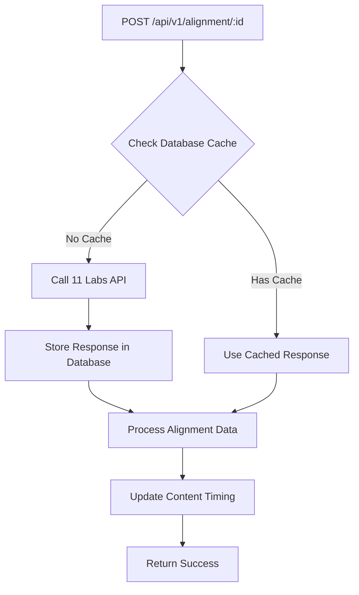

# 11 Labs Alignment Response Caching

This document describes the caching system for 11 Labs forced alignment responses to save costs and improve performance.

## 🎯 **Overview**

The alignment API now includes intelligent caching that:
- ✅ **Stores 11 Labs responses** in the database to avoid redundant API calls
- ✅ **Checks for cached data** before making new API calls
- ✅ **Saves costs** by reusing existing alignment data
- ✅ **Provides cache management** through API endpoints and UI

## 💾 **Database Schema**

Added new field to the `Content` model:

```prisma
model Content {
  // ... existing fields
  forceAlignmentResponse Json? // Stored alignment response from providers like 11 Labs
}
```

### **Cache Structure**
```json
{
  "provider": "eleven_labs",
  "timestamp": "2025-07-31T06:15:30.123Z",
  "response": {
    "characters": [...],
    "words": [...],
    "loss": 0.15
  },
  "textLength": 337,
  "audioFile": "coffee_and_cake.mp3"
}
```

## 🔄 **Caching Logic**

### **1. Alignment Request Flow**


### **2. Cache Hit Behavior**
When cached alignment exists:
- ✅ **Skip 11 Labs API call** (saves cost)
- ✅ **Use cached response** immediately
- ✅ **Still process data** to update content timing
- ✅ **Return success** with `cached: true` flag
- ✅ **Log cache usage** in console

### **3. Cache Miss Behavior**
When no cached alignment exists:
- 🚀 **Call 11 Labs API** with text and audio
- 💾 **Store response** in database immediately
- 🔧 **Process alignment data** to update content
- ✅ **Return success** with `cached: false` and log file

## 🛠️ **API Endpoints**

### **Main Alignment Endpoint**
```http
POST /api/v1/alignment/:content_id
```
- **Checks cache first** before calling 11 Labs
- **Stores response** after successful API call
- **Returns cache status** in response

### **Cache Management Endpoints**

#### **Check Cache Status**
```http
GET /api/v1/alignment/cache/:content_id
```
**Response:**
```json
{
  "success": true,
  "data": {
    "contentId": "coffee-and-cake",
    "title": "Coffee and Cake Conversation",
    "hasCachedAlignment": true,
    "provider": "eleven_labs",
    "cachedAt": "2025-07-31T06:15:30.123Z",
    "textLength": 337,
    "audioFile": "coffee_and_cake.mp3"
  }
}
```

#### **Clear Cache**
```http
DELETE /api/v1/alignment/cache/:content_id
```
**Response:**
```json
{
  "success": true,
  "data": {
    "contentId": "coffee-and-cake",
    "title": "Coffee and Cake Conversation",
    "message": "Cached alignment cleared successfully"
  }
}
```

## 🎨 **Management Interface Updates**

### **Visual Indicators**
- **💾 Cached**: Shows below alignment status for items with cached data
- **🗑️ Clear Cache**: Button to remove cached alignment data
- **Cache Status**: Visible in content table for easy identification

### **User Actions**
1. **View Cache Status**: Automatically shown in content table
2. **Clear Individual Cache**: Click "🗑️ Clear Cache" button
3. **Force Re-alignment**: Clear cache, then click "⚡ Align"

## 💰 **Cost Savings**

### **Before Caching**
- Every alignment request → 11 Labs API call
- Repeated processing of same content → Multiple charges
- Testing/debugging → Expensive iteration

### **After Caching**
- ✅ **First request**: Calls 11 Labs API (charged once)
- ✅ **Subsequent requests**: Use cached data (free)
- ✅ **Content updates**: Reprocess cached alignment (free)
- ✅ **Testing**: Work with cached data (free)

### **When Cache is Used**
- Same content text and audio file
- Repeated alignment requests
- Content timing updates
- Testing and debugging

### **When New API Call is Made**
- First time aligning content
- After clearing cache
- Content text changes (future enhancement)
- Audio file changes (future enhancement)

## 🔧 **Development Workflow**

### **Testing with Cache**
1. **First alignment**: `POST /api/v1/alignment/content-id` → Calls 11 Labs
2. **Check cache**: `GET /api/v1/alignment/cache/content-id` → Shows cached data
3. **Repeat alignment**: `POST /api/v1/alignment/content-id` → Uses cache
4. **Clear cache**: `DELETE /api/v1/alignment/cache/content-id` → Removes cache
5. **Re-align**: `POST /api/v1/alignment/content-id` → Calls 11 Labs again

### **Console Output**
```bash
# Cache hit
💾 Using cached alignment response from database
💾 Stored 11 Labs alignment response in database

# Cache miss
🚀 Making 11 Labs API request: {...}
✅ 11 Labs API response: {...}
💾 Stored 11 Labs alignment response in database

# Cache cleared
🗑️ Cleared cached alignment for content: content-id
```

## 🎯 **Best Practices**

### **For Development**
- ✅ **Use cache during testing** to avoid repeated API calls
- ✅ **Clear cache** when testing alignment logic changes
- ✅ **Check cache status** before debugging alignment issues

### **For Production**
- ✅ **Cache persists** across server restarts
- ✅ **Monitor cache usage** through management interface
- ✅ **Clear cache** only when content changes significantly

### **For Cost Management**
- ✅ **First alignment** per content item incurs 11 Labs cost
- ✅ **All subsequent alignments** use free cached data
- ✅ **Content updates** process cached data without new API calls
- ✅ **Testing iterations** work with cached responses

## 🚀 **Future Enhancements**

### **Smart Cache Invalidation**
- Detect content text changes
- Detect audio file changes
- Automatic cache expiration
- Version-based caching

### **Multi-Provider Support**
- Support for other alignment providers
- Provider preference settings
- Fallback provider logic
- Cost comparison analytics

### **Advanced Cache Management**
- Batch cache operations
- Cache analytics and reporting
- Cache size optimization
- Export/import cache data

## 📊 **Monitoring**

### **Cache Hit Rate**
Track how often cached data is used vs new API calls:
- High hit rate = Good cost savings
- Low hit rate = Content frequently changing

### **Cache Storage**
Monitor database growth from stored alignment responses:
- Large responses stored per content item
- Consider cleanup policies for old cache data

### **API Cost Tracking**
Compare costs before/after caching implementation:
- Measure 11 Labs API usage reduction
- Calculate cost savings over time
- Optimize cache strategy based on usage patterns